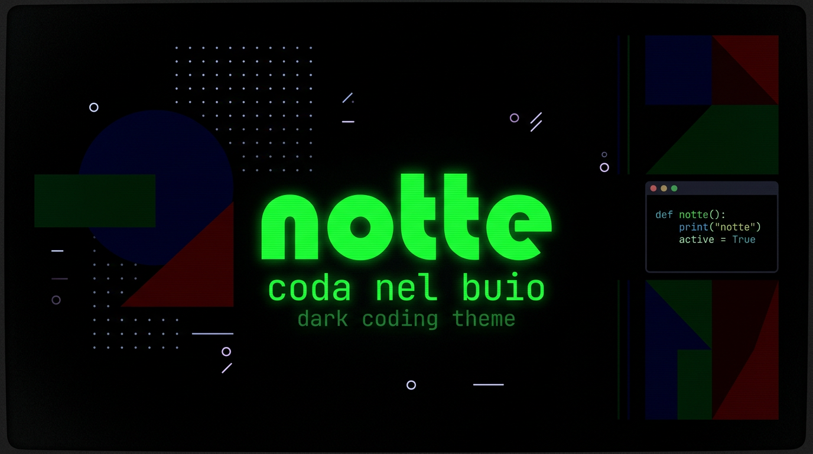

# fornace

A true-dark [pi coding agent](https://github.com/earendil-works/pi-mono) theme with Homebrew green text and intentional single-channel backgrounds.



## What makes it different

- **Homebrew green text** (`#00FF00`) — bright, unmistakable
- **True dark backgrounds** — nearly black, with at most 2 non-zero RGB channels per surface
- **Warm tool text** — `toolTitle` and `toolOutput` use warm near-white neutrals that work across all tool states
- **Tinted message text** — user messages get blue-white (`#EEEEFF`), custom messages get lavender (`#F0E6FF`)
- **All 51 color slots filled** — zero inheritance from the default theme. Fully self-contained.
- **Export colors included** — HTML export gets matching deep dark backgrounds

## Color palette

### Variables

| Name | Value | Usage |
|------|-------|-------|
| `cyan` | `#00d7ff` | Border accents |
| `blue` | `#5f87ff` | Borders |
| `green` | `#b5bd68` | Success, code blocks |
| `red` | `#cc6666` | Error, removed diffs |
| `yellow` | `#ffff00` | Warning |
| `gray` | `#808080` | Muted text, markdown elements |
| `dimGray` | `#666666` | Very dim text, link URLs |
| `darkGray` | `#505050` | Muted borders, thinking off |
| `accent` | `#8abeb7` | Primary accent, inline code, list bullets |

### Background surfaces

| Token | Value | Channels |
|-------|-------|----------|
| `selectedBg` | `#000022` | Blue only |
| `userMessageBg` | `#00001c` | Blue only |
| `customMessageBg` | `#10001c` | Red + Blue |
| `toolPendingBg` | `#000018` | Blue only |
| `toolSuccessBg` | `#001800` | Green only |
| `toolErrorBg` | `#180000` | Red only |
| `pageBg` (export) | `#000008` | Blue only |
| `cardBg` (export) | `#00000e` | Blue only |
| `infoBg` (export) | `#000014` | Blue only |

### Text colors

| Token | Value |
|-------|-------|
| `text` | `#00FF00` |
| `userMessageText` | `#EEEEFF` |
| `customMessageText` | `#F0E6FF` |
| `customMessageLabel` | `#9575cd` |
| `toolTitle` | `#F5F3F3` |
| `toolOutput` | `#C8BFB8` |
| `thinkingText` | `#808080` |

### Thinking levels

| Level | Color |
|-------|-------|
| Off | `#505050` |
| Minimal | `#6e6e6e` |
| Low | `#5f87af` |
| Medium | `#81a2be` |
| High | `#b294bb` |
| XHigh | `#d183e8` |

## Install

Copy the theme file to your pi themes directory:

```sh
cp fornace.json ~/.pi/agent/themes/fornace.json
```

Then activate it in `~/.pi/agent/settings.json`:

```json
{
  "theme": "fornace"
}
```

Pi auto-reloads themes on file change — no restart needed.

## Design rules

1. **Backgrounds have at most 2 non-zero RGB channels** — unsaturated channels are exactly `0`, not "nearly zero". This creates deliberate color intent.
2. **Text colors match their background hue** — near-white tints derived from the background's channel ratios (e.g., blue bg `#00001c` → text `#EEEEFF`).
3. **`toolTitle` and `toolOutput` are shared across all tool states** — they can't be state-specific, so they use warm neutrals that read cleanly on all three backgrounds.
4. **Palette is cool/dark** — no warm/fire colors in the backgrounds. Single-channel tints only.
5. **Main text is Homebrew green** (`#00FF00`) — the signature color.

## Schema

Validated against [pi theme schema](https://raw.githubusercontent.com/earendil-works/pi-mono/main/packages/coding-agent/src/modes/interactive/theme/theme-schema.json). All 51 required color tokens defined. No unknown tokens.

## License

MIT
